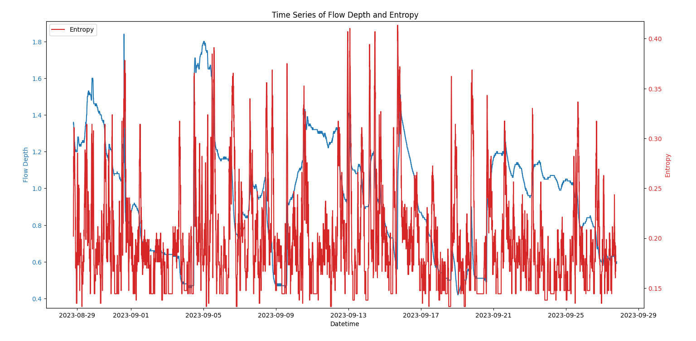
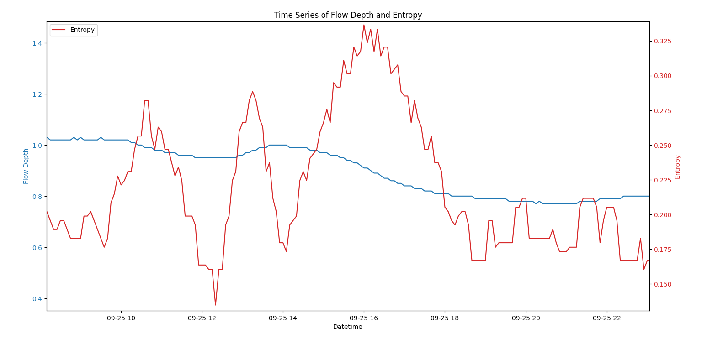
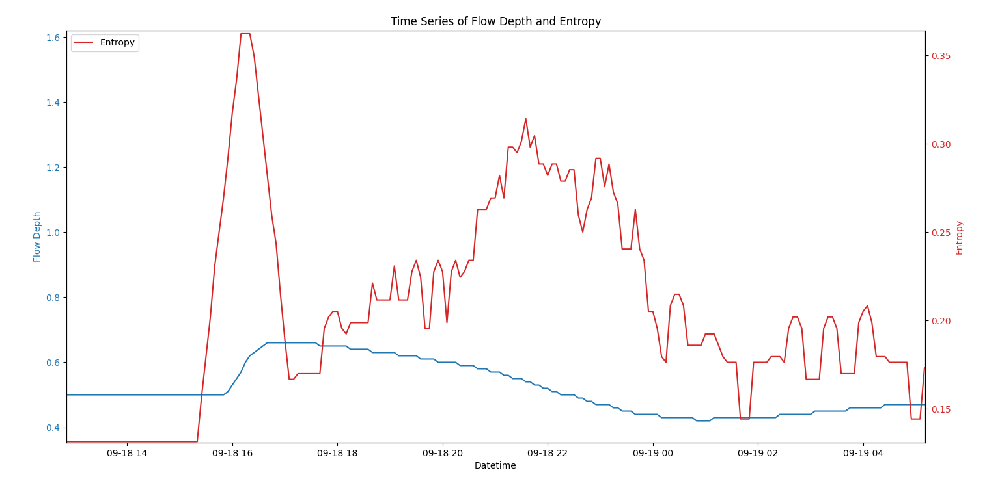
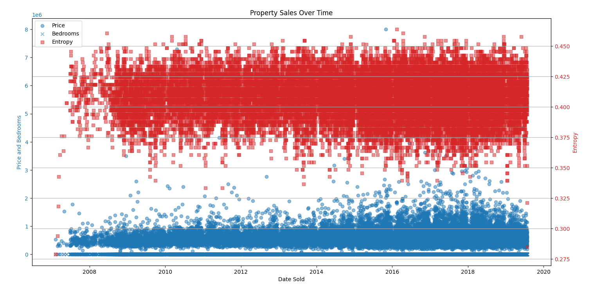
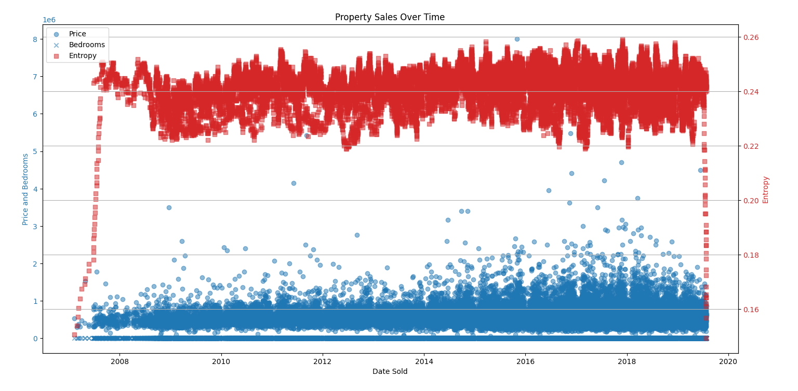
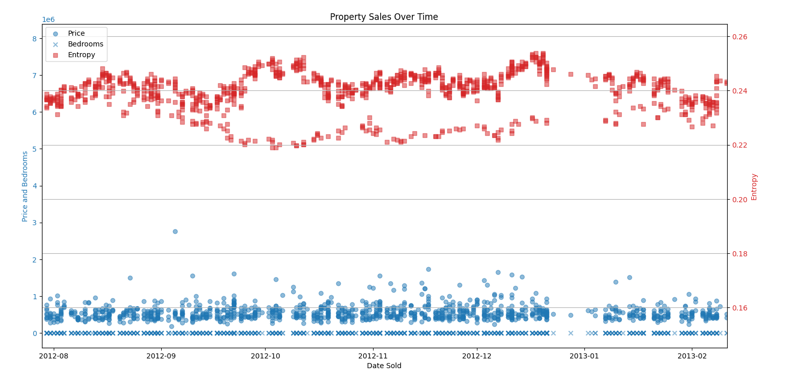

# Data Insights without Data Processing Headaches

There is a lot of talk in my industry right now about using AI to "Analyze a customers data, and find issues without human intervention".  This can be challenging to implement.  AI centered solutions typically require very well formatted training data, and a lot of it.  They also typically rely on metadata about each individual time-series or dataset in order to work;  a model trained on rainfal data is not applicable to snowfall data, despite their real world similarity.

I was curious if I could deliver a similar product without AI.  This project uses information theory and some clever re-use of gZip (which is asicized on most modern CPUS) to analyze data for "points of interest" without the need for training or context.

# The Algorithm:

Given a pile of data in an arbitrary iterable format, compute the "information density" at each data point.  this will yield a new dataset which represents vaguely "How much interesting stuff is in the data" at any given time.

# The Implementation:

Computing "information density" is theoretically quite computationally expensive.  And it also requires data to be well formatted, and it is not generalizable across domains in a way that really satisfies the "AI Dream".

But what if we just "pickle" all the datapoints, and then use gzip to compress the pickles across a sliding window of data?

"Information Density" will roughly correspond with "Compression Ratio".  Areas with not much going on will compress very well, and areas with lots of interesting data will compress very poorly.

The biggest upside to this approach, is we can put arbitrary data into the pickles, and gain "information density" insights about data without needing to know hardly anything about the format of the data.

# A Demo

I've downloaded stream gauge time-series data from a river in my hometown, and put it into a nicely formatted CSV.

main.py in this project will read the CSV into python objects, generate the aforementioned "entropy" time series, and then plot both with matPlotLib

# How well does it work?

Running main.py generates the following graph, with data in blue and entropy in red.  You can see that spikes in the entropy do roughly correspond to interesting parts of the graph.

Zooming in on some "rolling" data, we can see that the entropy series peaks in the middle of "events of interest" in the original data.  In this case The peaks correspond to a dip, a rise, and then a more substantial dip in river flow.  The magnitude of spikes in the "entropy" graph are roughly proportional to the magnitude of interested data in the original.  Longer/Larger events of interest result in larger spikes in entropy.

The algorithm does a reasonable job of amplifying small changes that might be more "interesting" because of how quickly they occur.  In this area of the data there is a quite steep step in the graph.  The spike in entropy is correspondingly large. 

These examples don't seem impressive compared to bespoke or manual algorithms, specifically tuned to find discontinuities in river water data.  But keep in mind, the algorithm here doesn't know anything about water or sensors.  It doesn't even know that the data it is analyzing is a time series.  The only requirement is that the data is an iterable format.

# But what about more complex data?

I've downloaded a dataset with data for housing sales in america.  It contains sale price, bedrooms, and sale date.  Here is what a scatter plot of that dataset looks like, along with the entropy plot in red again:

The entropy graph here is a little less useful, it does show seasonal variation patterns, and a few interesting patterns pop out, like the big reduction in entropy in the data in late 2013 (which corresponds to the "end" of the 2008 housing bubble.)

Let's try this again, with a much larger sliding window size.  The new dataset is more complicated, it makes sense that we would want to be able to correlate more data together for each datapoint:

With a larger sliding window, the algorithm immediately finds the 2008 housing crash.  Interestingly it manifests as LESS entropy in the dataset, and so the entropy graph has a minimum over that time.

There is something else interesting around 2012.  As the housing market picked back up, we see two distinct "groups" form in the entropy.  I suspect the algorithm has identified how some markets recovered differently than others here, and it has left an artifact in the entropy plot there.

These examples show how gzip entropy analysis can take arbitrary data across more than 2 dimensions, and reduce it to a single dimension (how interesting is the data).  Areas of the entropy chart that look interesting in 2 dimensions cna represent areas in a complex dataset that are interesting across arbitrary numbers of dimensions.
